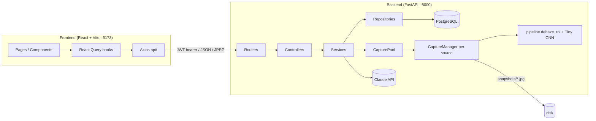
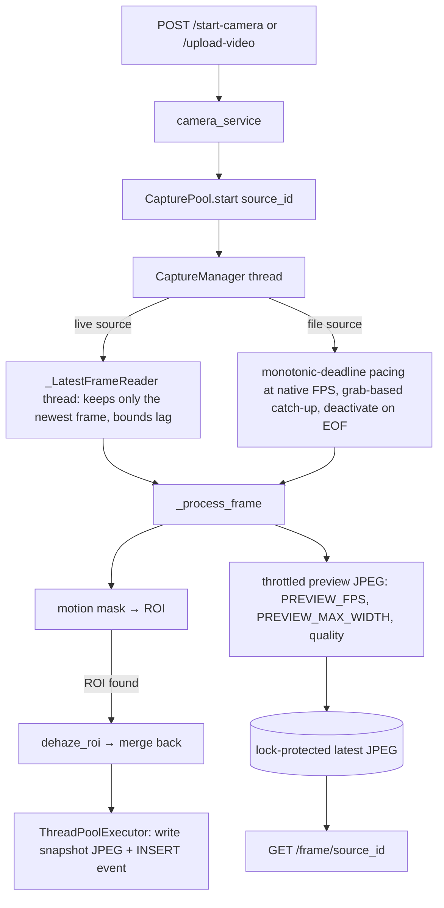
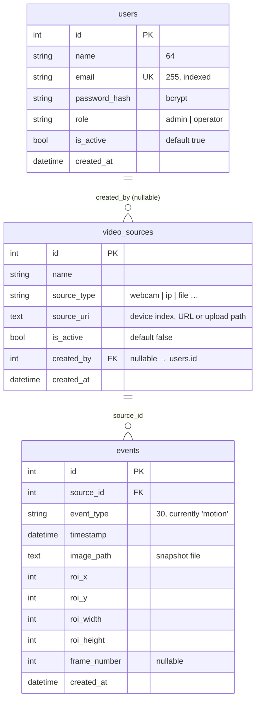

# VisionGuard AI — Architecture & Design

A CPU-friendly CCTV surveillance platform that enhances visibility in hazy or smoggy footage in real time. It combines a classical physics prior (Dark Channel Prior) with a Tiny CNN that only refines the transmission map. It is **not** end-to-end deep learning.

_Last updated: 2026-10-01. See `CLAUDE.md` for the rules this design follows, and `README.md` for setup._

---

## 1. System overview



| Concern | Choice |
|---|---|
| Backend | Python 3.11+, FastAPI, SQLAlchemy 2 + psycopg2, PyJWT + passlib/bcrypt, pydantic-settings |
| CV / ML | OpenCV, NumPy, PyTorch (CPU only) |
| NLP search | Claude API (Anthropic SDK), only to parse a query into filters |
| Database | PostgreSQL only (credentials as separate `POSTGRES_*` vars) |
| Frontend | React 19, TypeScript (strict), Vite, Tailwind v4, shadcn-style primitives, TanStack Query, Axios, react-router |

---

## 2. Methodology

### 2.1 Hybrid dehazing: physics + light learning

Haze is modelled by the atmospheric scattering model:

```
I(x) = J(x)·t(x) + A·(1 − t(x))      →      J(x) = (I(x) − A) / max(t(x), t_min) + A
```

`I` is the observed frame, `J` the haze-free radiance, `A` the atmospheric light and `t` the transmission. All reconstruction uses this equation. The Tiny CNN's only job is to improve `t`.

**Per-frame pipeline** (`backend/services/pipeline.py::dehaze_roi`, the only place the steps are chained):

```
Frame
 → motion detection (MOG2 on a downscaled grayscale copy)  — no motion ⇒ skip everything
 → ROI extraction (merge contours, pad, clamp, area cap)
 → downscale ROI to DEHAZE_MAX_SIDE
 → dark channel                    (min over colour channels + erosion over a patch)
 → atmospheric light               (average of the Top-K brightest dark-channel pixels, with a minimum pixel floor)
 → coarse transmission             t = 1 − ω · dark(I / A)
 → Tiny CNN refinement             (skipped if weights are missing ⇒ pure DCP)
 → guided upsample of t            (edge-aware, full-res grayscale as guide)
 → radiance recovery               (scattering-model inversion, t floored at t_min)
 → gamma correction
 → merge enhanced ROI back into the frame
```

Key design choices:

| Choice | Why |
|---|---|
| **ROI-only dehazing** | The cost scales with the moving region, not the frame. This is the main CPU optimisation. |
| **Top-K average for `A`** | A single brightest pixel flickers frame to frame. |
| **Classical stages on a downscaled ROI** | Dark channel, atmosphere and transmission were the dominant cost on large ROIs. Cost is now roughly flat (about 30–46 ms) regardless of ROI size. |
| **Guided upsample (hand-rolled, `cv2.boxFilter`)** | Replaces naive bilinear upsampling, which smeared `t` across depth edges and caused DCP halos. `cv2.ximgproc` is not installed, so it is hand-rolled. |
| **`roi_max_area_ratio`** | If merged motion would cover over 35% of the frame, fall back to the largest contour, so scattered motion can't balloon the ROI to full frame. |
| **Warm-up gate** | Ignore the first `MOTION_WARMUP_FRAMES` frames, because MOG2 startup produces false motion. |
| **Event cooldown** | At most one logged event per source per `EVENT_COOLDOWN_SECONDS`. |
| **Model loaded once** | Weights are loaded in the app lifespan and injected into the capture pool. They are never loaded in a request handler. |

### 2.2 Tiny CNN (`backend/models/tiny_cnn.py`)

- **Input:** 3 channels (grayscale ROI, dark channel, coarse transmission). **Output:** refined transmission, with a sigmoid.
- **Layers:** `Conv3×3(16) → ReLU → Conv3×3(32) → ReLU → Conv3×3(16) → ReLU → Conv3×3(1) → Sigmoid`. This is 9,857 parameters.
- ROIs larger than `REFINE_MAX_SIDE` are refined at a capped resolution and upsampled.
- **Training lives in `training/`, not in services.** It uses a **reconstruction loss** through a differentiable mirror of radiance recovery with the *estimated* `A`, plus a small L1 term to the true `t`. Training on `t`-L1 alone made the end-to-end output worse. Top-K `A` is underestimated on scenes without bright sky, and DCP's underestimated `t` was accidentally compensating.
- **Data:** synthetic scenes (`dataset.py`) mixed with the REVIDE paired real-haze dataset (`revide.py`).
- **Known gap:** the CNN over-darkens sky and glows around lights on outdoor dusk footage, because REVIDE is indoor-only. Next ideas: outdoor pairs, residual `Δt`, a larger receptive field.

### 2.3 Natural-language search

`GET /events/search?q=…` sends the query to Claude through structured output (`messages.parse`) and gets back `ParsedFilters {from_ts, to_ts, event_type}`. The ordinary SQL path then runs the query.

- The LLM is used for **parsing only**. Filtering is plain SQL.
- It **never raises**. A missing key, API error or validation error logs a warning and returns empty filters, so the user gets all events (the rule is "widen rather than error").
- The model, token limit and timeout are settings.

### 2.4 Engineering principles

Priority order is simplicity, readability, modularity, explainability, then CPU efficiency.

- **Strict layering:** router → controller → service → repository → DB. Routers hold no logic and controllers never touch the DB.
- Auth is enforced only at the router level, through `Depends()`.
- All config comes from `.env` via `config.py`. There is no hardcoding and no `print()`.
- Per-source state lives in the `CapturePool` on `app.state`, injected through `Depends`. It is not a module global.

---

## 3. Backend design

### 3.1 Layout

```
backend/
├── main.py                 app + lifespan (CPU threads, DB tables/migrations, admin seed, model load, CapturePool)
├── config.py               pydantic-settings
├── api/
│   ├── dependencies.py     get_db, get_capture_pool, get_current_user, require_admin
│   └── routers/            auth, camera, events, search, system
├── controllers/            auth, camera, event, search, system  (HTTP mapping + error → status code)
├── services/
│   ├── pipeline.py         the dehazing chain
│   ├── dehazing/           dark_channel, atmosphere, transmission, refine, guided_filter, radiance, gamma
│   ├── motion/             motion_detector (MOG2), roi
│   ├── capture_service.py  CaptureManager (one per source) + CapturePool
│   ├── camera_service.py   start / stop / upload / list sources
│   ├── event_service.py    log, list, snapshot read, delete
│   ├── auth_service.py     bcrypt, JWT, user management rules
│   ├── nlp_search.py       Claude → ParsedFilters
│   ├── system_service.py   health
│   └── runtime_tuning.py   caps torch/cv2 thread counts
├── models/tiny_cnn.py      nn.Module + loader (returns None if weights missing)
├── schemas/                Pydantic request/response models
└── db/                     database.py, models.py, repositories/{event,user,video_source}_repository.py
```

### 3.2 Capture runtime



- One thread, one motion detector and one frame buffer per source. Sources start and stop independently.
- Snapshot I/O and DB writes run off the capture thread, on a copy of the frame taken before the ROI rectangle is drawn.
- At startup, any rows still marked active (from a crashed run) are deactivated.
- A source that can't be opened rolls back its activation and returns 400.

### 3.3 Authentication and authorisation

```
POST /auth/login {email, password} → authenticate() (timing-safe, dummy hash when the user is unknown; rejects inactive users)
  → JWT (HS256, JWT_EXPIRE_MINUTES) → Authorization: Bearer <token> on every other call
```

- `get_current_user` is applied at router level to every router except the login route. `require_admin` guards account and destructive routes.
- **No open signup.** On startup, if no users exist and `ADMIN_PASSWORD` is set, an admin is seeded from `ADMIN_NAME` / `ADMIN_EMAIL` / `ADMIN_PASSWORD`.
- **Roles:** `admin` (everything, plus account management and event deletion) and `operator` (everything else).
- **Safety rules in `set_user_active`:** you can't deactivate yourself, and you can't deactivate the last active admin.
- Duplicate emails raise `UserAlreadyExistsError`.

### 3.4 Startup migrations

`Base.metadata.create_all` can't add columns to existing tables, so the lifespan runs idempotent SQL in the repositories: `ensure_created_by_column` (`video_sources.created_by`), `ensure_is_active_column`, and `ensure_email_column` (renames `username` to `name` and backfills `email`).

---

## 4. Database schema (PostgreSQL)



**Indexes on `events`:** `(source_id, timestamp)` and `(event_type, timestamp)`, matching the timeline and filter queries. `users.email` is unique and indexed.

All DB access goes through the repositories in `backend/db/repositories/`. Snapshot images are files in `SNAPSHOT_DIR`, and `events.image_path` points to them. Clients read them through `GET /events/{id}/snapshot`, not a public static mount.

---

## 5. API reference

All routes require `Authorization: Bearer <jwt>` except `POST /auth/login`. Interactive docs are at `/docs`.

### Auth

| Method | Path | Access | Description |
|---|---|---|---|
| POST | `/auth/login` | public | `{email, password}` → `{access_token, token_type, expires_in}` |
| GET | `/auth/me` | any user | Current user |
| PATCH | `/auth/password` | any user | Change own password (`current_password`, `new_password`) |
| PATCH | `/auth/profile` | any user | Update own `name` / `email` |
| POST | `/auth/users` | admin | Create an account (`name`, `email`, `password` ≥ 8 chars, `role`) |
| GET | `/auth/users` | admin | List accounts |
| PATCH | `/auth/users/{user_id}/status` | admin | Activate / deactivate (`{is_active}`) |

### Cameras

| Method | Path | Description |
|---|---|---|
| GET | `/cameras` | List currently active sources |
| POST | `/start-camera` | `{name?, source_uri?}` — start a live/IP/webcam feed as a new active source (400 if it can't be opened) |
| POST | `/upload-video` | Multipart file — save to `UPLOAD_DIR` and start it as a source |
| POST | `/stop-camera/{source_id}` | Stop one feed |
| GET | `/frame/{source_id}` | Latest processed frame (`image/jpeg`) |

### Events

| Method | Path | Access | Description |
|---|---|---|---|
| GET | `/events` | any user | Query: `source_id`, `event_type`, `from_ts`, `to_ts`, `limit` (1–200), `offset` → `{events, total}` |
| GET | `/events/search?q=` | any user | Natural-language search → `{query, parsed_filters, events, total}` |
| GET | `/events/{id}/snapshot` | any user | Snapshot JPEG |
| DELETE | `/events/{id}` | admin | Delete an event (204) |

### System

| Method | Path | Description |
|---|---|---|
| GET | `/system/status` | `{status, database, pipeline}` — runs a `SELECT 1` health probe |

Errors: typed service exceptions (not found, already exists, invalid credentials, self-lockout, last admin, capture error) are mapped to HTTP status codes in the controllers.

---

## 6. Frontend design

### 6.1 Layering

```
api/        pure async Axios functions (no React)           authApi, cameraApi, eventsApi, systemApi, client
hooks/      React Query useQuery/useMutation wrappers        all server state lives here
components/ presentational + container components           ui/ = shadcn-style primitives
pages/      one component per route; composes hooks + components
types/      single source of truth, mirrors Pydantic schemas
lib/utils.ts  className helper
```

- `client.ts` holds the Axios instance. The request interceptor adds `Authorization: Bearer <token>` (token in `localStorage` under `visionguard_token`). The response interceptor clears the token and redirects to `/login` on a 401.
- Images (`/frame`, snapshots) are fetched as authenticated blobs and shown through object URLs, because a plain `` can't send headers. URLs are revoked when replaced, to avoid memory leaks.

### 6.2 Routes and pages

| Route | Page | Guard | Purpose |
|---|---|---|---|
| `/` | `LandingPage` | public | Product intro; the call to action depends on login state |
| `/login` | `LoginPage` | public | Email + password sign-in |
| `/dashboard` | `Dashboard` | `ProtectedRoute` | Live multi-camera grid, "add camera" controls (webcam/URL/upload), system status, recent events strip |
| `/events` | `EventsPage` | `ProtectedRoute` | Timeline of logged events and the natural-language search bar with parsed-filter chips |
| `/profile` | `ProfilePage` | `ProtectedRoute` | Edit name/email, change password |
| `/admin` | `AdminPage` | `ProtectedRoute` + `RequireAdmin` | User table (create operator, activate/deactivate) and event management (delete) |

Protected pages render inside `AppLayout` (top bar, user menu, theme toggle, toasts).

### 6.3 Hooks

| Hook | File | Backing call | Notes |
|---|---|---|---|
| `useCurrentUser` | `useAuth.ts` | `GET /auth/me` | `staleTime: Infinity`; the key is `CURRENT_USER_KEY` |
| `useLogin` / `useLogout` | `useAuth.ts` | `POST /auth/login` | Store or clear the token and reset the cache |
| `useChangePassword`, `useUpdateProfile` | `useAuth.ts` | `PATCH /auth/password`, `/auth/profile` | |
| `useCreateUser`, `useUsers`, `useSetUserStatus` | `useAuth.ts` | `/auth/users…` | Admin only |
| `useActiveCameras` | `useCamera.ts` | `GET /cameras` | Polls every 4 s, so the grid follows server state and survives refresh |
| `useStartCamera`, `useStopCamera`, `useUploadVideo` | `useCamera.ts` | camera mutations | Invalidate the camera list |
| `useLiveFrame(sourceId, enabled)` | `useCamera.ts` | `GET /frame/{id}` | Polls every 120 ms for the live view |
| `useEvents(params)` | `useEvents.ts` | `GET /events` | Filters and pagination |
| `useDeleteEvent` | `useEvents.ts` | `DELETE /events/{id}` | |
| `useEventSnapshot(eventId)` | `useEvents.ts` | `GET /events/{id}/snapshot` | `staleTime: Infinity`, because a stored image never changes |
| `useSnapshotObjectUrl(eventId)` | `useSnapshotObjectUrl.ts` | wraps the snapshot blob | Manages object-URL lifecycle |
| `useEventSearch(query)` | `useEventSearch.ts` | `GET /events/search` | |
| `useSystemStatus` | `useSystemStatus.ts` | `GET /system/status` | Polls every 5 s |
| `useTheme` | `useTheme.ts` | none (local) | Light/dark, persisted in storage |

### 6.4 Main components

`AppLayout`, `TopBar`, `UserMenu`, `ProtectedRoute`, `RequireAdmin` (shell and guards); `CameraChipBar`, `CameraGrid`, `CameraTile`, `CameraControls`, `VideoFeed`, `LiveDot` (live view); `Timeline`, `EventListItem`, `EventThumb`, `RecentEventsStrip`, `SearchBar` (events); `SystemStatusPanel`; `ProfileForm`, `ChangePasswordForm`, `CreateOperatorForm` (account forms); `ui/` (button, card, input, label, badge, skeleton, dialog, alert-dialog, dropdown-menu, tabs, table, avatar, separator, sonner).

---

## 7. Configuration

All values come from `.env` through `backend/config.py`. See `.env.example`.

| Group | Keys |
|---|---|
| Model / paths | `MODEL_PATH`, `UPLOAD_DIR`, `SNAPSHOT_DIR` |
| Database | `POSTGRES_HOST/PORT/USER/PASSWORD/DB` |
| Auth | `JWT_SECRET_KEY`, `JWT_EXPIRE_MINUTES`, `ADMIN_NAME`, `ADMIN_EMAIL`, `ADMIN_PASSWORD` |
| Motion / ROI | `MOTION_MIN_AREA`, `MOTION_WARMUP_FRAMES`, `MOTION_MAX_SIDE`, `ROI_PADDING`, `ROI_MAX_AREA_RATIO`, `EVENT_COOLDOWN_SECONDS` |
| Dehazing | `DCP_PATCH_SIZE`, `ATMO_TOP_K_RATIO`, `ATMO_MIN_PIXELS`, `DEHAZE_OMEGA`, `DEHAZE_T_MIN`, `DEHAZE_GAMMA`, `DEHAZE_MAX_SIDE`, `REFINE_MAX_SIDE`, `GUIDED_FILTER_RADIUS`, `GUIDED_FILTER_EPS` |
| Streaming | `PREVIEW_FPS`, `PREVIEW_MAX_WIDTH`, `PREVIEW_JPEG_QUALITY`, `CAPTURE_MAX_LAG_FRAMES` |
| CPU | `TORCH_NUM_THREADS`, `CV_NUM_THREADS` |
| NLP | `ANTHROPIC_API_KEY`, `ANTHROPIC_MODEL`, `ANTHROPIC_MAX_TOKENS`, `ANTHROPIC_TIMEOUT_SECONDS` |

---

## 8. Testing and quality

- `tests/` holds pytest suites for dark channel, transmission, the CNN, motion detector, ROI and the pipeline. That is 29 tests, including a scattering-model round-trip. There are **no tests yet** for the auth/admin/snapshot endpoints.
- Backend tooling: black, isort, ruff, mypy. Frontend: strict TypeScript.

## 9. Scope

- **In scope (MVP):** auth, live/IP/upload feeds, motion + ROI, hybrid dehazing, event logging, timeline, natural-language search, multi-camera.
- **Future only:** object/intrusion detection, ONNX Runtime, FFmpeg, and residual `Δt` prediction.
- **Known limitations:** outdoor dehaze quality (see 2.2). The `/system/status` `pipeline` field is currently a static `"idle"`. Search has only been exercised through the no-key fallback.
