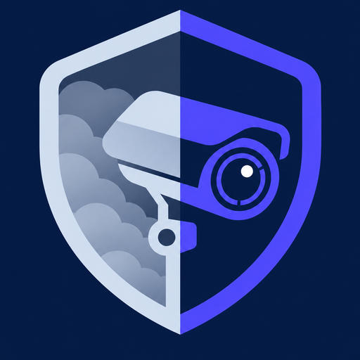
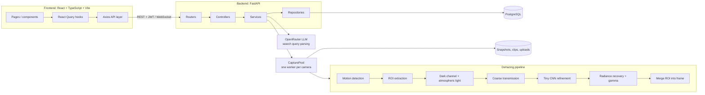
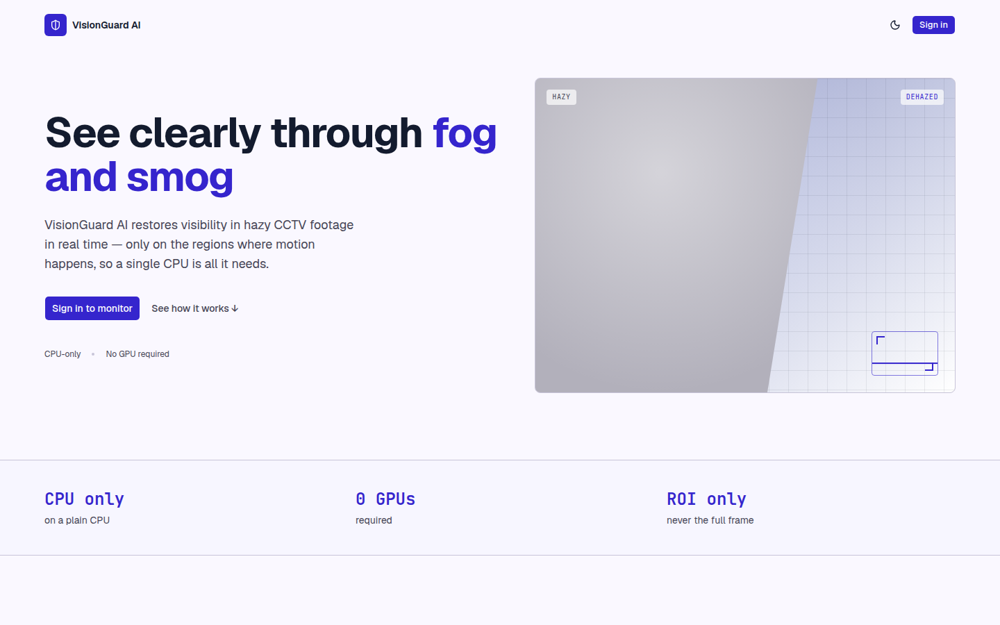
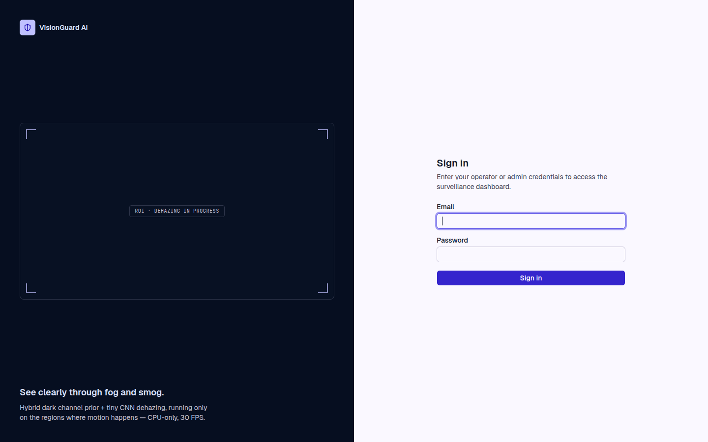
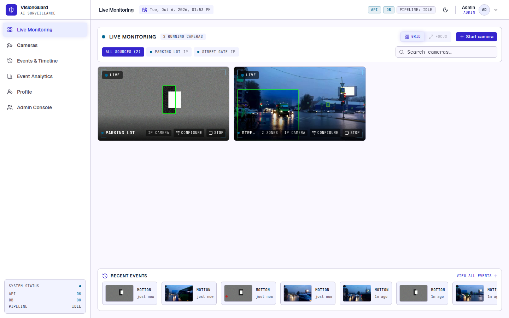
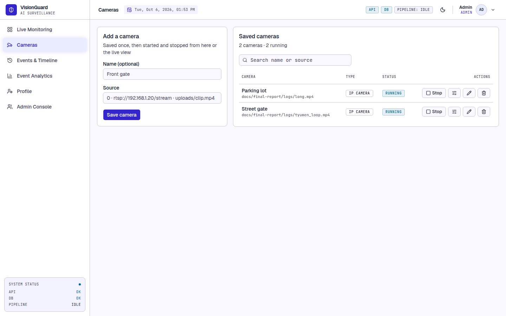
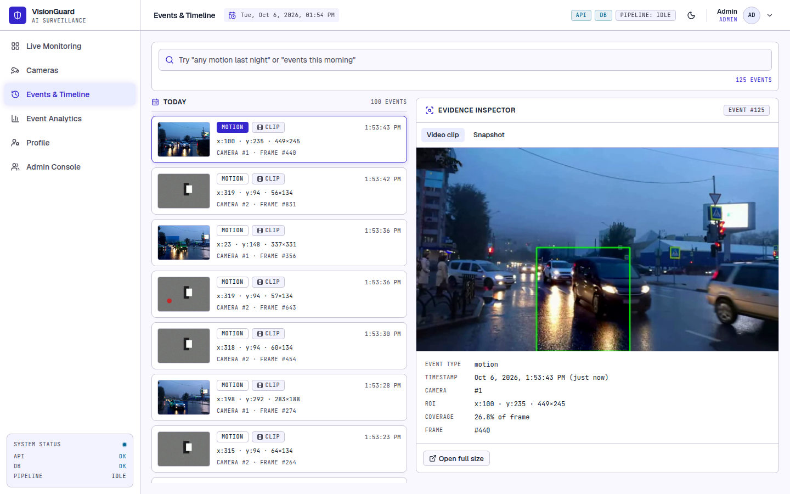
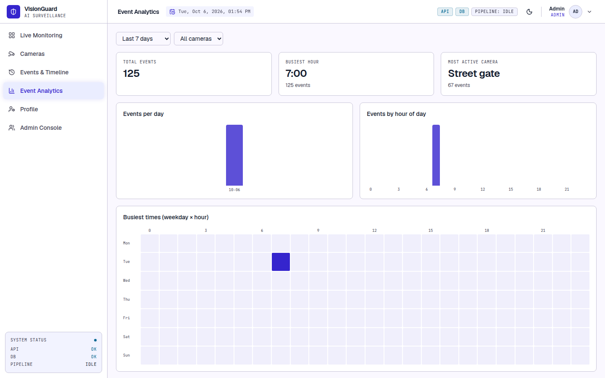
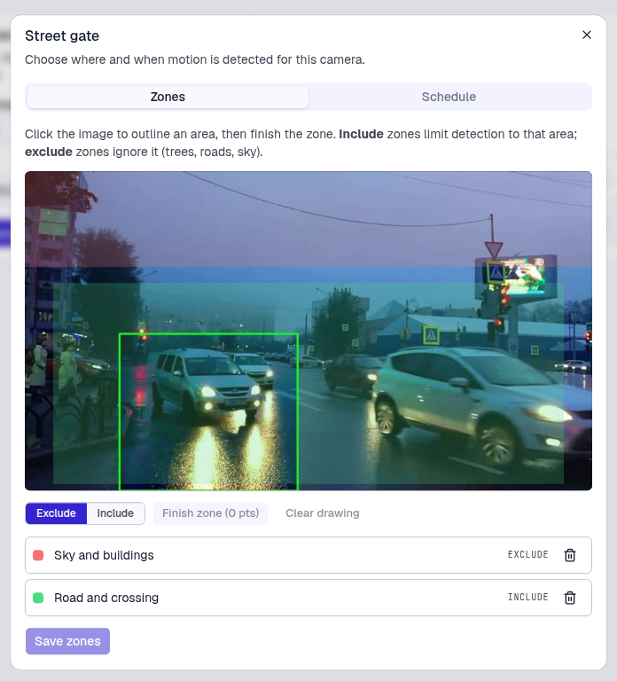
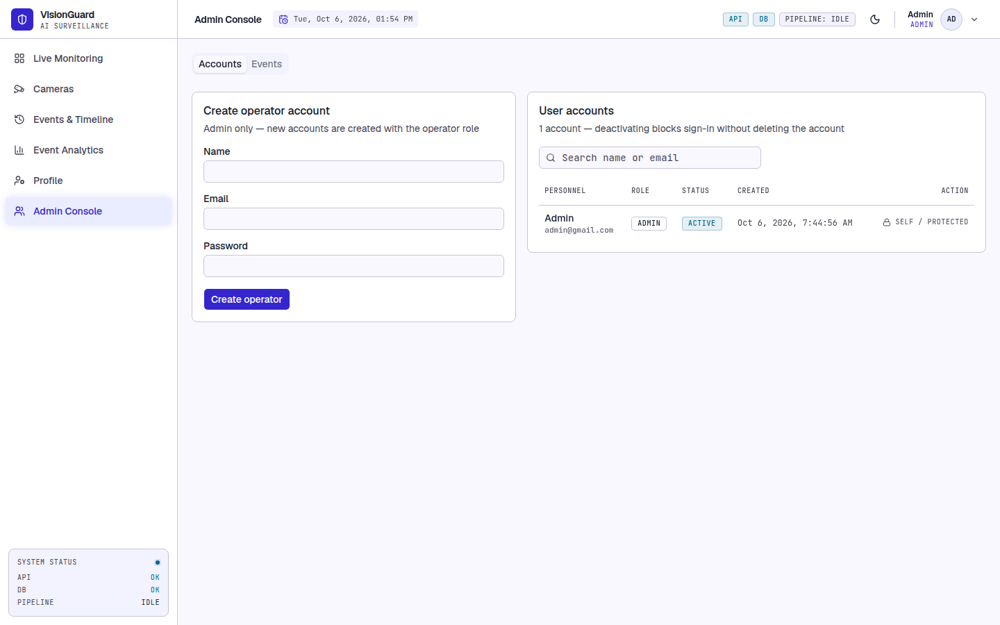

<p align="center">
  
</p>

<h1 align="center">VisionGuard AI</h1>

<p align="center">
  <b>Live demo:</b> <a href="https://visionguarding.netlify.app">visionguarding.netlify.app</a>
</p>

VisionGuard AI is a lightweight, CPU-friendly CCTV surveillance platform that restores visibility in hazy or smoggy footage in real time. It pairs a classical Dark Channel Prior (DCP) with a Tiny CNN that refines the transmission map, and it only dehazes the region where motion was detected, so it runs without a GPU.

## Features

- **Hybrid dehazing:** DCP and atmospheric scattering model, with a Tiny CNN refining the transmission map.
- **Motion-gated ROI processing:** frames with no motion are skipped, and only the motion region is dehazed.
- **Multi-camera:** webcam, IP/RTSP stream, uploaded video, or a phone/laptop camera streamed from the browser. Cameras start and stop independently.
- **Detection zones and schedules:** include/exclude polygons and weekly arming schedules per camera.
- **Event logging:** timestamped events with snapshot, video clip and ROI coordinates, plus a timeline browser.
- **Natural-language search:** ask "any motion last night?" and an LLM (via OpenRouter) turns it into filters.
- **Analytics:** events per day, per camera, weekday x hour heatmap.
- **Accounts:** JWT auth with admin-seeded accounts; every user's cameras and events are private to them.

## Getting started

### Prerequisites

- Python 3.11+
- Node.js 18+
- PostgreSQL 14+ (or Docker, see `docker-compose.yml`)
- Optional: an [OpenRouter](https://openrouter.ai) API key for natural-language search. Without one, queries return unfiltered results.

### 1. Backend

```bash
python3 -m venv venv
source venv/bin/activate
pip install -r requirements.txt

createdb visionguard
cp .env.example .env
```

Edit `.env` and set at least `POSTGRES_*`, `JWT_SECRET_KEY` (any long random string), and `ADMIN_EMAIL` / `ADMIN_PASSWORD` (seeds the first admin on startup). The Tiny CNN weights are checked in at `backend/weights/tiny_cnn.pth`.

```bash
uvicorn backend.main:app --reload
```

The API runs at `http://localhost:8000` (docs at `/docs`). Database migrations are applied automatically on startup.

### 2. Frontend

```bash
cd frontend
npm install
cp .env.example .env   # VITE_API_URL defaults to http://localhost:8000
npm run dev
```

Open `http://localhost:5173` and sign in with the admin credentials from `.env`.

### 3. Tests

```bash
source venv/bin/activate
pytest
```

## Architecture



**Core idea:** physics prior (DCP) plus lightweight learning (Tiny CNN). The CNN only refines the transmission map; all image reconstruction uses the atmospheric scattering model.

- **Layering:** routers define routes only, controllers orchestrate, services hold business logic, repositories are the only code that touches the database.
- **Capture:** each camera runs in its own worker inside `CapturePool`. Frames without motion are skipped, and detected motion becomes an event with a snapshot and clip.
- **Multi-tenancy:** every camera, and everything under it, belongs to exactly one user.

## Screenshots

| Landing | Login |
|---|---|
|  |  |

| Live dashboard | Cameras |
|---|---|
|  |  |

| Events timeline | Analytics |
|---|---|
|  |  |

| Detection zones | Admin |
|---|---|
|  |  |
